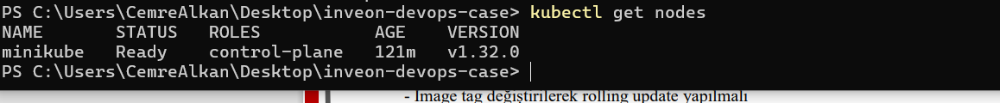
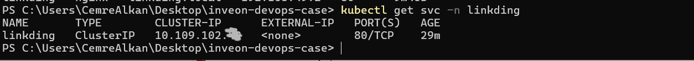
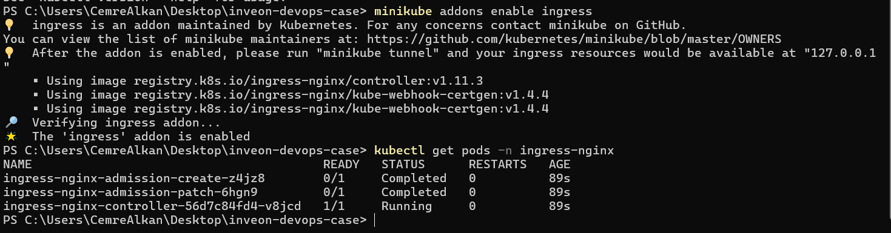
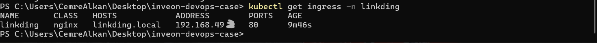
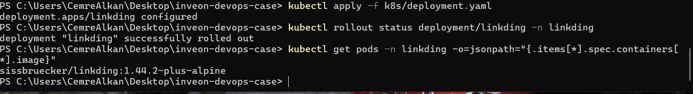
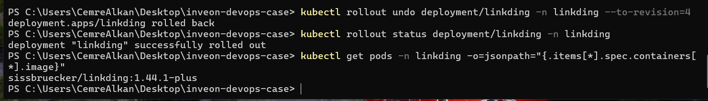
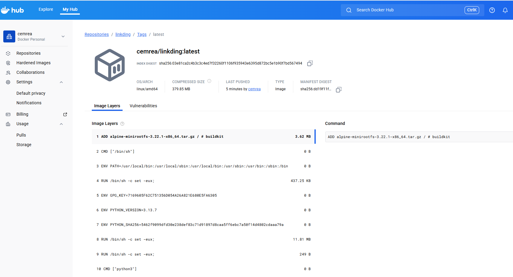
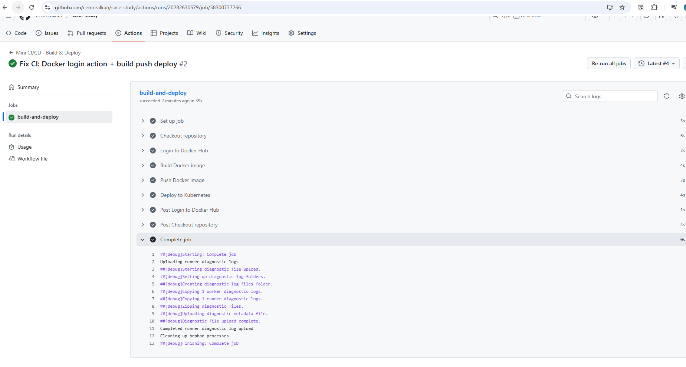
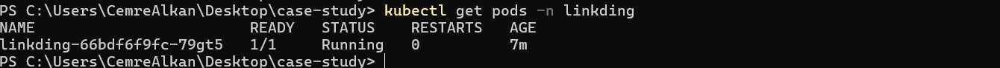

# DevOps Engineer Case Study

Bu repository, DevOps Engineer case çalışması kapsamında hazırlanmıştır.  
Çalışmada local bir Kubernetes ortamı üzerinde açık kaynak bir uygulamanın
deploy edilmesi, Ingress ile erişimin sağlanması, rolling update ve rollback
senaryolarının gösterilmesi hedeflenmiştir.

## Kubernetes Ortamı

Bu case kapsamında **Minikube** tercih edilmiştir.  
Minikube, local ortamda hızlı ve izole bir Kubernetes cluster
kurulumu sağladığı için seçilmiştir.

- Minikube versiyonu: v1.35.0
- Kubernetes versiyonu: v1.32.0


## Cluster Durumu

Bu case kapsamında Kubernetes cluster kurulumu için Minikube
kullanılmıştır. Minikube kurulumu daha önceden yapılmış olup,
cluster aşağıdaki komut ile ayağa kaldırılmıştır:

```bash
minikube start
```



## Namespace Yapılandırması

Uygulama kaynaklarının izole bir şekilde yönetilebilmesi amacıyla
`linkding` isimli bir Kubernetes namespace’i oluşturulmuştur.

Tüm Kubernetes objeleri (Deployment, Service, ConfigMap, Secret ve Ingress)
bu namespace altında deploy edilmiştir.


## Uygulama Deploy Edilmesi 

### ConfigMap

Uygulamaya ait konfigürasyon değerleri ConfigMap üzerinden yönetilmektedir.

```bash
kubectl apply -f k8s/configmap.yaml
kubectl get configmap -n linkding
```
### Secret

Uygulama ve Docker image pull işlemleri için iki farklı Kubernetes Secret kullanılmıştır:

- Docker Hub erişimi için imagePullSecret
- Uygulama konfigürasyonuna ait hassas bilgiler için application secret

#### Docker Hub Secret (imagePullSecret)
Linkding uygulamasının Docker Hub üzerinde private olarak tutulan image’ı
çekebilmesi için docker-registry tipinde bir Kubernetes Secret oluşturulmuştur.

Secret aşağıdaki komut ile oluşturulmuştur:

```bash
kubectl create secret docker-registry dockerhub-secret \
  --docker-server=https://index.docker.io/v1/ \
  --docker-username=<DOCKERHUB_USERNAME> \
  --docker-password=<DOCKERHUB_TOKEN> \
  --docker-email=<EMAIL> \
  -n linkding
```

#### Uygulama Secret (linkding-secret)
Uygulamaya ait hassas bilgiler (örneğin secret key, admin bilgileri vb.)
Kubernetes Secret objesi içerisinde tutulmaktadır.

```bash
kubectl apply -f k8s/secret.yaml
```

### Deployment

Linkding uygulaması bir Kubernetes Deployment objesi olarak tanımlanmıştır.
Uygulama tek replica ile çalışacak şekilde konfigüre edilmiştir.

```bash
kubectl apply -f k8s/deployment.yaml
kubectl get pods -n linkding
```


### Service

Uygulama, cluster içi erişim için ClusterIP tipinde bir Service ile yayınlanmıştır.

```bash
kubectl apply -f k8s/service.yaml
kubectl get svc -n linkding
```



## Ingress Controller

Minikube ortamında Ingress controller olarak NGINX Ingress Controller kullanılmıştır.

```bash
minikube addons enable ingress
```


## Ingress Erişimi

Uygulamaya dış erişim sağlamak amacıyla Ingress objesi tanımlanmıştır.
Minikube ortamında Ingress erişimi için aşağıdaki komut çalıştırılmıştır:

```bash
minikube tunnel
```



Uygulama aşağıdaki adres üzerinden erişilebilir hale gelmiştir:
http://linkding.local


## Rolling Update & Rollback

Deployment üzerinde image tag değiştirilerek rolling update işlemi gerçekleştirilmiştir.

### Rolling Update

Başlangıçta çalışan image:

- `sissbruecker/linkding:1.44.1-plus`

Deployment manifesti güncellenerek image aşağıdaki versiyona çekilmiştir:

- `sissbruecker/linkding:1.44.2-plus-alpine`

```bash
kubectl apply -f k8s/deployment.yaml
kubectl rollout status deployment/linkding -n linkding
```


### Rollback

Rolling update sonrasında, uygulama önceki stabil versiyona geri döndürülmüştür.
Rollback işlemi ile deployment, otomatik olarak bir önceki revision’a dönmüştür:

- `sissbruecker/linkding:1.44.1-plus`

```bash
kubectl rollout undo deployment/linkding -n linkding
```



## Otomasyon (setup.sh)  

Tüm Kubernetes kaynaklarının tek komutla deploy edilebilmesi amacıyla
setup.sh script’i hazırlanmıştır.

Script aşağıdaki işlemleri otomatik olarak gerçekleştirir:

- Cluster erişimini doğrular
- Namespace oluşturur (gerekirse)
- Kubernetes manifestlerini uygular
- Deployment rollout durumunu kontrol eder

```bash
./setup.sh
```


## Optional CI/CD (GitHub Actions)

Bu case kapsamında opsiyonel bir mini CI/CD süreci
GitHub Actions kullanılarak oluşturulmuştur.

Amaç; source code üzerinde yapılan bir değişikliğin ardından:

- Docker image build edilmesi
- Docker Hub registry’ye push edilmesi
- Kubernetes ortamına otomatik deploy edilmesi

adımlarının uçtan uca otomatik olarak gerçekleştirilmesini sağlamaktır.

### CI/CD Akışı

Pipeline aşağıdaki adımlardan oluşmaktadır:

1. GitHub repository üzerinde `main` branch’e yapılan push işlemi ile pipeline tetiklenir
2. GitHub Actions runner üzerinde Docker Hub’a login olunur
3. Uygulama için Docker image build edilir
4. Oluşturulan image Docker Hub registry’ye push edilir
5. Kubernetes deployment rollout restart edilerek yeni image otomatik olarak yayına alınır









### GitHub Actions Runner Yapısı

Bu case kapsamında Kubernetes cluster’a erişim sağlanabilmesi ve
`kubectl` komutlarının çalıştırılabilmesi için
**self-hosted GitHub Actions runner** kullanılmıştır.

Runner, local ortamda çalışacak şekilde yapılandırılmış ve
GitHub repository ile başarıyla ilişkilendirilmiştir.

### GitHub Actions – Docker Hub Entegrasyonu

Docker Hub erişimi için GitHub Actions repository secrets kullanılmıştır:

- `DOCKERHUB_USERNAME`
- `DOCKERHUB_TOKEN`

Bu sayede Docker Hub kimlik bilgileri pipeline içerisinde
güvenli bir şekilde yönetilmiştir.

### Kubernetes Deploy

Pipeline’ın son adımında aşağıdaki komutlar çalıştırılarak
Kubernetes deployment otomatik olarak güncellenmiştir:

```bash
kubectl rollout restart deployment/linkding -n linkding
kubectl rollout status deployment/linkding -n linkding
```

#### Notlar

Not!:
Bu case kapsamında CI/CD pipeline basit tutulmuş olup,
main branch’e yapılan push’lar sonrasında otomatik deploy gerçekleştirilmektedir.
Gerçek production senaryolarında feature branch, pull request
ve approval mekanizmaları tercih edilebilir.

Not!!:
Case’in ilk aşamalarında Linkding uygulaması Docker Hub üzerinde
hazır bulunan resmi image kullanılarak deploy edilmiştir.
CI/CD sürecinin eklenmesiyle birlikte deployment manifesti güncellenmiş
ve uygulama, bu repository içerisinde yer alan Dockerfile kullanılarak
build edilen custom Docker image üzerinden çalıştırılmaya başlanmıştır.


